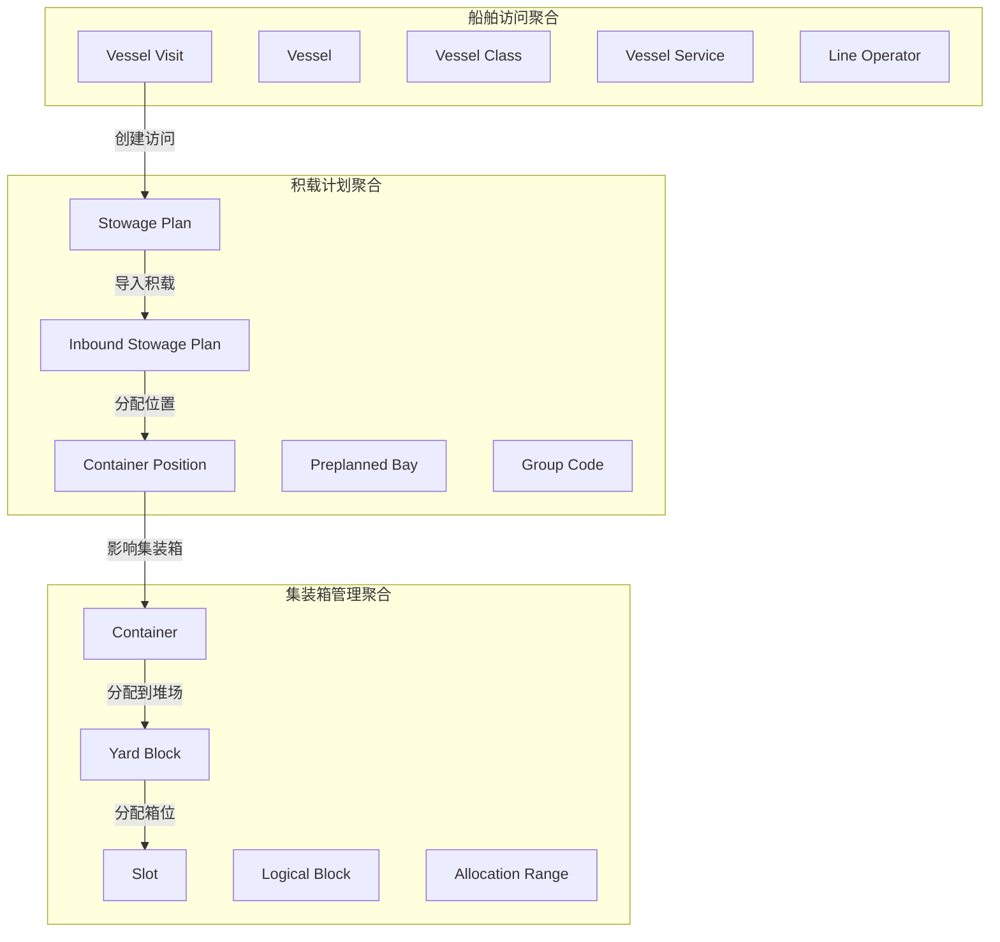
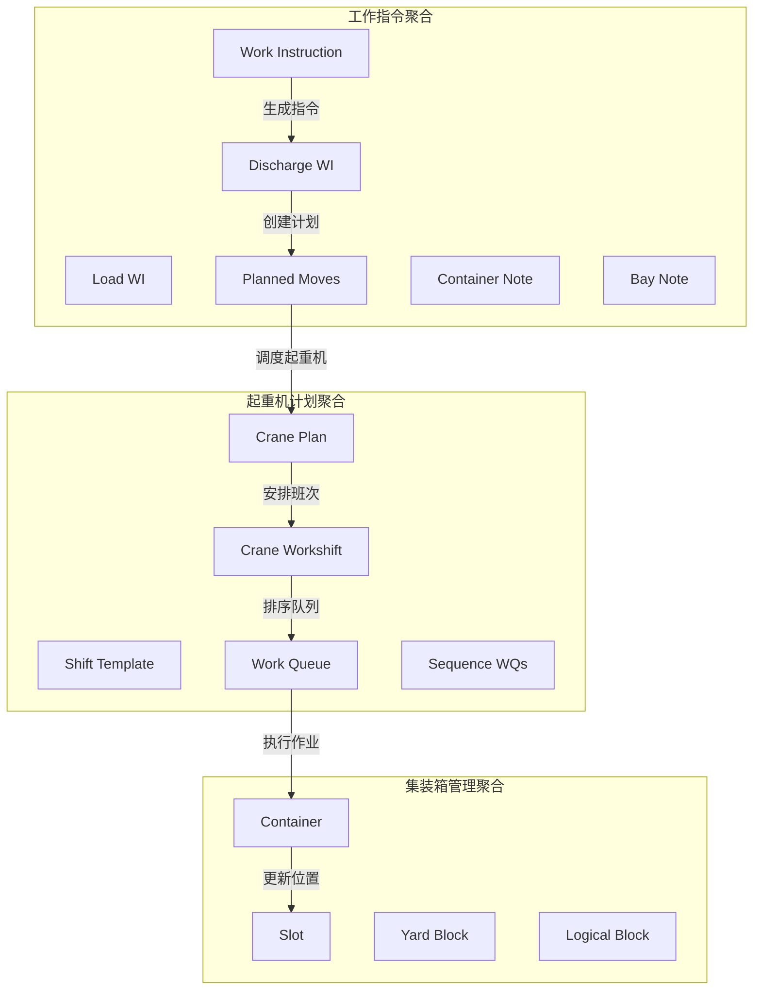
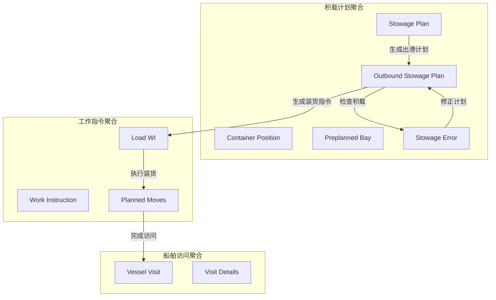
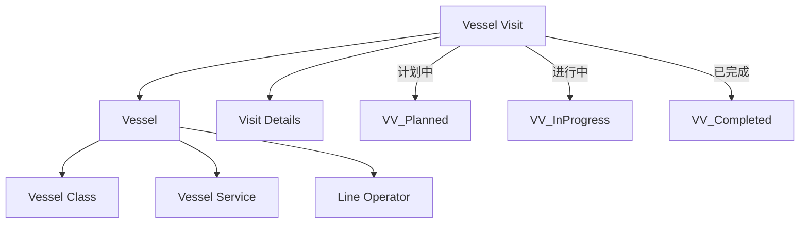
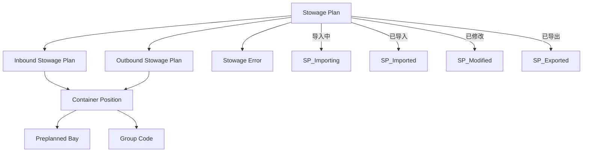
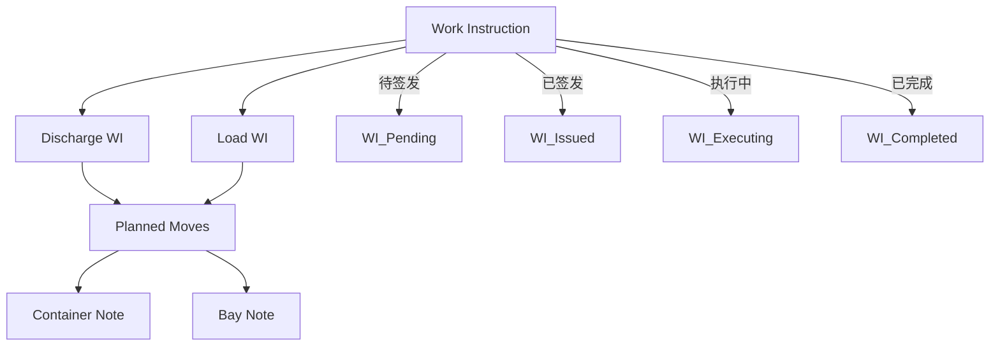
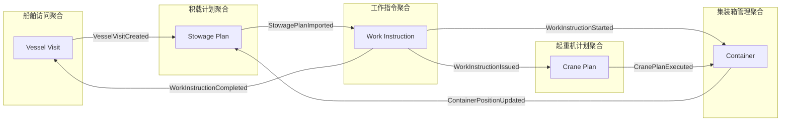
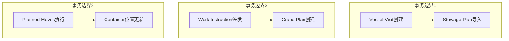

# TOS聚合详细关系图

## 一、核心业务场景聚合关系

### 场景1：船舶到港流程

### 场景2：装卸作业流程

### 场景3：船舶离港流程

## 二、聚合内部实体关系

### Vessel Visit聚合内部关系

### Stowage Plan聚合内部关系

### Work Instruction聚合内部关系

## 三、聚合间通信事件

### 领域事件流

## 四、聚合边界验证

### 业务规则验证

| 聚合 | 业务规则 | 验证点 |
|------|----------|--------|
| **Vessel Visit** | 一次访问对应一个船舶 | 船舶ID唯一性检查 |
| **Stowage Plan** | 进港出港计划独立 | 计划类型隔离 |
| **Work Instruction** | 指令基于积载计划 | 计划依赖关系 |
| **Crane Plan** | 起重机能力约束 | 设备能力检查 |
| **Container Management** | 位置唯一性 | 位置冲突检测 |

### 一致性边界

## 五、聚合设计优化建议

### 1. **聚合大小优化**
- Vessel Visit聚合：适中，包含必要船舶信息
- Stowage Plan聚合：较大，可考虑按进港/出港拆分
- Work Instruction聚合：适中，指令执行边界清晰
- Crane Plan聚合：较小，设备调度边界明确
- Container Management聚合：较大，可考虑按区域拆分

### 2. **性能优化策略**
- 使用事件溯源处理复杂状态变化
- 聚合间通过事件异步通信
- 支持聚合的并发访问控制
- 考虑聚合的读写分离

### 3. **扩展性设计**
- 预留业务规则扩展点
- 支持新的作业策略接入
- 通过领域事件支持功能扩展
- 聚合设计支持业务变更 