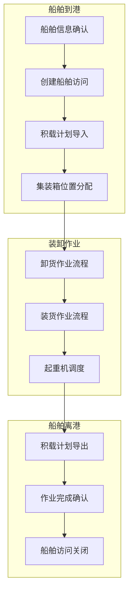

# TOS业务场景梳理

## 一、核心业务场景概览

基于design文件夹中的所有文档分析，识别出以下核心业务场景：

### 1. **船舶访问管理场景**
- 船舶信息管理
- 船舶访问创建
- 访问状态管理

### 2. **积载计划管理场景**
- 进港积载计划处理
- 出港积载计划处理
- 积载错误处理

### 3. **装卸作业执行场景**
- 卸货作业流程
- 装货作业流程
- 作业指令管理

### 4. **起重机调度场景**
- 起重机计划制定
- 班次管理
- 作业队列优化

### 5. **集装箱管理场景**
- 集装箱位置管理
- 堆场分配
- 集装箱状态跟踪

## 二、详细业务场景

### 场景1：船舶到港流程

**业务描述：** 船舶到达港口，开始装卸作业准备

**主要步骤：**
1. **船舶信息确认**
   - 检查船舶类别是否存在
   - 确认船务公司信息
   - 验证船公司信息
   - 创建或确认船舶信息

2. **创建船舶访问**
   - 建立船舶访问记录
   - 设置访问详情
   - 初始化访问状态

3. **积载计划导入**
   - 接收进港积载计划
   - 验证积载计划完整性
   - 处理积载错误

4. **集装箱位置分配**
   - 根据积载计划分配集装箱位置
   - 确定堆场分配策略
   - 生成箱位分配方案

**涉及聚合：**
- Vessel Visit聚合
- Stowage Plan聚合
- Container Management聚合

**关键事件：**
- VesselVisitCreated
- StowagePlanImported
- ContainerPositionAllocated

### 场景2：卸货作业流程

**业务描述：** 执行船舶卸货作业

**主要步骤：**
1. **卸货预计划制定**
   - 创建卸货预计划
   - 确定卸货顺序
   - 分配作业资源

2. **工作指令签发**
   - 生成卸货工作指令
   - 选择签发方式（EC系统/纸质）
   - 分发作业任务

3. **起重机计划制定**
   - 创建起重机计划
   - 安排起重机班次
   - 优化作业队列

4. **卸货作业执行**
   - 执行计划作业
   - 记录实际作业结果
   - 更新集装箱位置

**涉及聚合：**
- Work Instruction聚合
- Crane Plan聚合
- Container Management聚合

**关键事件：**
- WorkInstructionIssued
- CranePlanCreated
- DischargeCompleted

### 场景3：装货作业流程

**业务描述：** 执行船舶装货作业

**主要步骤：**
1. **空箱订单管理**
   - 处理空箱订单
   - 确定装货需求
   - 准备装货计划

2. **装货预计划制定**
   - 创建装货预计划
   - 确定装货顺序
   - 验证积载计划

3. **工作指令签发**
   - 生成装货工作指令
   - 选择签发方式
   - 分发作业任务

4. **装货作业执行**
   - 执行装货作业
   - 记录作业结果
   - 更新积载计划

**涉及聚合：**
- Work Instruction聚合
- Stowage Plan聚合
- Container Management聚合

**关键事件：**
- LoadWorkInstructionIssued
- LoadCompleted
- StowagePlanUpdated

### 场景4：船舶离港流程

**业务描述：** 完成装卸作业，船舶准备离港

**主要步骤：**
1. **积载计划导出**
   - 生成出港积载计划
   - 验证积载完整性
   - 处理积载错误

2. **作业完成确认**
   - 确认所有作业完成
   - 验证集装箱状态
   - 更新访问状态

3. **船舶访问关闭**
   - 关闭船舶访问
   - 生成访问报告
   - 归档相关数据

**涉及聚合：**
- Vessel Visit聚合
- Stowage Plan聚合
- Container Management聚合

**关键事件：**
- StowagePlanExported
- VesselVisitCompleted
- ReportsGenerated

### 场景5：积载计划管理

**业务描述：** 管理船舶货物分布计划

**主要步骤：**
1. **积载计划导入**
   - 接收EDI积载数据
   - 手动录入积载信息
   - 验证积载计划

2. **积载计划修改**
   - 修改集装箱位置
   - 调整积载方案
   - 处理积载错误

3. **积载计划验证**
   - 检查积载规范
   - 验证集装箱位置
   - 确认积载完整性

**涉及聚合：**
- Stowage Plan聚合
- Container Management聚合

**关键事件：**
- StowagePlanImported
- StowagePlanModified
- StowageErrorDetected

### 场景6：起重机调度管理

**业务描述：** 管理起重机作业调度

**主要步骤：**
1. **起重机计划制定**
   - 创建起重机计划
   - 设置班次模板
   - 分配作业资源

2. **班次管理**
   - 创建起重机班次
   - 安排作业人员
   - 设置作业时间

3. **作业队列优化**
   - 排序作业队列
   - 优化作业顺序
   - 平衡作业负载

**涉及聚合：**
- Crane Plan聚合
- Work Instruction聚合

**关键事件：**
- CranePlanCreated
- WorkshiftScheduled
- WorkQueueOptimized

## 三、业务场景关系图

## 四、业务场景验证

### 完整性验证
- ✅ 覆盖船舶完整生命周期
- ✅ 包含所有核心业务操作
- ✅ 涉及所有主要聚合

### 一致性验证
- ✅ 业务场景间逻辑一致
- ✅ 聚合边界清晰明确
- ✅ 事件流设计合理

### 可扩展性验证
- ✅ 支持新业务场景接入
- ✅ 预留业务规则扩展点
- ✅ 支持业务变更

## 五、业务场景实施优先级

### 第一阶段（核心场景）
1. 船舶到港流程
2. 船舶离港流程
3. 积载计划管理

### 第二阶段（作业场景）
1. 卸货作业流程
2. 装货作业流程
3. 起重机调度管理

### 第三阶段（优化场景）
1. 作业优化
2. 性能优化
3. 扩展功能 