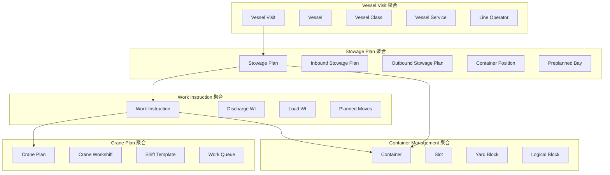

# TOS领域关系图与聚合设计

## 一、核心聚合根识别

### 1. **Vessel Visit（船舶访问）聚合**
**聚合根：** Vessel Visit
**边界：** 一次完整的船舶进出港业务周期

**包含实体：**
- Vessel Visit（聚合根）
- Vessel（船舶信息）
- Vessel Class（船舶类别）
- Vessel Service（船务公司）
- Line Operator（船公司）
- Visit Details（访问详情）

**业务规则：**
- 一个船舶访问对应一个船舶
- 访问期间包含完整的装卸作业流程
- 访问状态：计划中 → 进行中 → 已完成

### 2. **Stowage Plan（积载计划）聚合**
**聚合根：** Stowage Plan
**边界：** 船舶货物分布规划

**包含实体：**
- Stowage Plan（聚合根）
- Inbound Stowage Plan（进港积载）
- Outbound Stowage Plan（出港积载）
- Container Position（集装箱位置）
- Preplanned Bay（预计划贝位）
- Group Code（箱分组）
- Stowage Error（积载错误）

**业务规则：**
- 进港和出港积载计划独立管理
- 集装箱位置必须符合船舶积载规范
- 积载错误需要及时识别和处理

### 3. **Work Instruction（工作指令）聚合**
**聚合根：** Work Instruction
**边界：** 装卸作业执行指令

**包含实体：**
- Work Instruction（聚合根）
- Discharge WI（卸货指令）
- Load WI（装货指令）
- Planned Moves（计划作业）
- Container Note（集装箱备注）
- Bay Note（贝位备注）

**业务规则：**
- 工作指令基于积载计划生成
- 指令状态：待执行 → 执行中 → 已完成
- 支持EC系统签发和纸质签发两种方式

### 4. **Crane Plan（起重机计划）聚合**
**聚合根：** Crane Plan
**边界：** 起重机作业调度

**包含实体：**
- Crane Plan（聚合根）
- Crane Workshift（起重机班次）
- Shift Template（班次模板）
- Work Queue（作业队列）
- Sequence WQs（队列排序）

**业务规则：**
- 起重机计划基于工作指令制定
- 班次安排考虑设备能力和作业效率
- 作业队列需要合理排序优化

### 5. **Container Management（集装箱管理）聚合**
**聚合根：** Container
**边界：** 集装箱生命周期管理

**包含实体：**
- Container（聚合根）
- Slot（箱位）
- Yard Block（堆场区块）
- Logical Block（逻辑区块）
- Allocation Range（分配范围）
- Container Position（集装箱位置）

**业务规则：**
- 集装箱位置必须可追溯
- 堆场分配遵循优化策略
- 集装箱状态实时更新

## 二、聚合间关系图

## 三、领域事件定义

### 船舶访问相关事件
- `VesselVisitCreated` - 船舶访问创建
- `VesselVisitStarted` - 船舶访问开始
- `VesselVisitCompleted` - 船舶访问完成

### 积载计划相关事件
- `StowagePlanImported` - 积载计划导入
- `StowagePlanModified` - 积载计划修改
- `StowageErrorDetected` - 积载错误检测

### 工作指令相关事件
- `WorkInstructionIssued` - 工作指令签发
- `WorkInstructionStarted` - 工作指令开始执行
- `WorkInstructionCompleted` - 工作指令完成

### 起重机计划相关事件
- `CranePlanCreated` - 起重机计划创建
- `CranePlanOptimized` - 起重机计划优化
- `CranePlanExecuted` - 起重机计划执行

## 四、聚合边界设计原则

### 1. **高内聚原则**
- 每个聚合内的实体紧密相关
- 聚合内部状态变化保持一致
- 业务规则在聚合内部强制执行

### 2. **低耦合原则**
- 聚合间通过领域事件通信
- 避免聚合间的直接引用
- 使用ID引用而非对象引用

### 3. **一致性边界**
- 事务边界与聚合边界一致
- 并发控制以聚合为单位
- 数据一致性在聚合内保证

### 4. **业务完整性**
- 聚合边界反映业务完整性
- 聚合根保护聚合内部一致性
- 外部只能通过聚合根访问聚合

## 五、聚合设计验证

### 业务场景验证
1. **船舶到港流程**：Vessel Visit聚合创建 → Stowage Plan聚合导入 → Work Instruction聚合生成
2. **装卸作业流程**：Work Instruction聚合执行 → Crane Plan聚合调度 → Container Management聚合更新
3. **船舶离港流程**：Stowage Plan聚合导出 → Vessel Visit聚合关闭

### 性能考虑
- 聚合大小适中，避免大聚合
- 聚合间通过事件异步通信
- 支持聚合的并发访问

### 扩展性设计
- 聚合边界预留扩展空间
- 领域事件支持松耦合扩展
- 聚合设计支持业务规则变更 