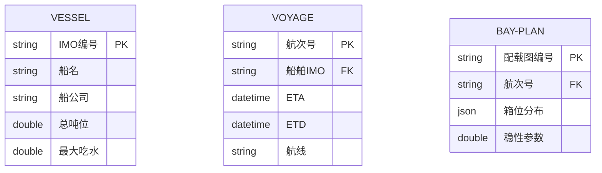
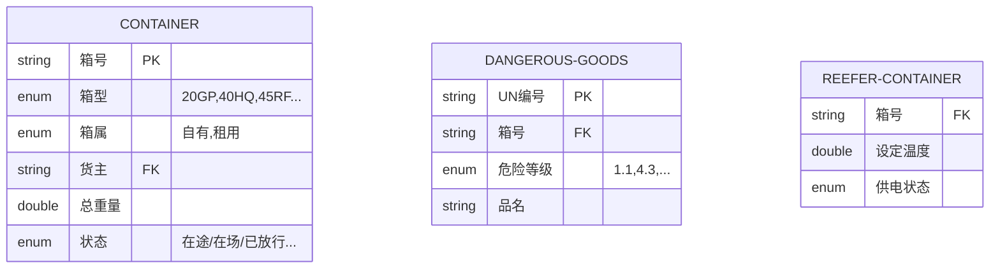
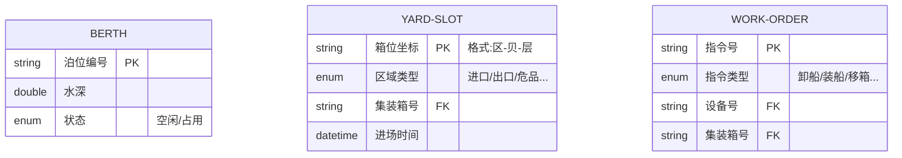
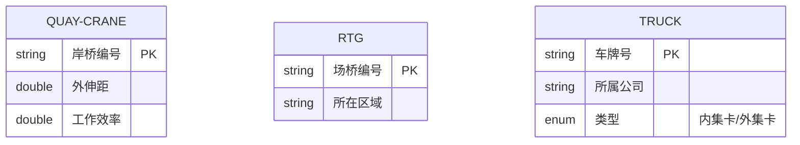
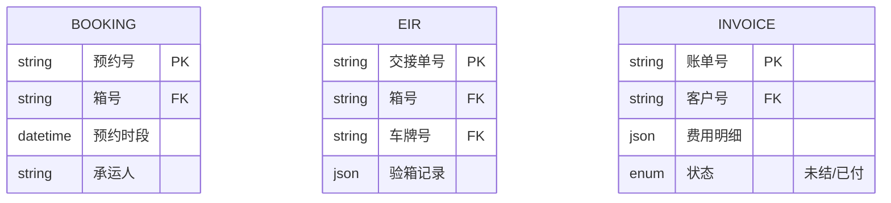
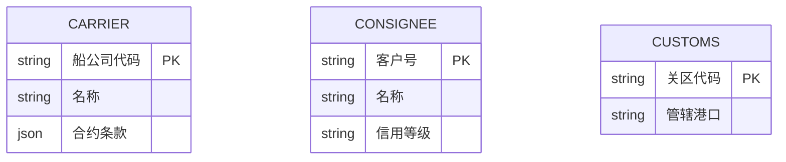
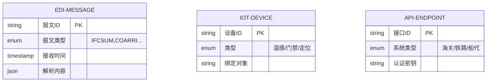
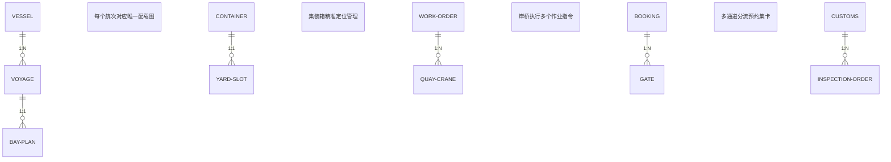

### 港口TOS核心实体列表 (基于用例提取)

#### 1. **船舶相关实体**

```mermaid
erDiagram
    VESSEL {
        string IMO编号 PK
        string 船名
        string 船公司
        double 总吨位
        double 最大吃水
    }
    VOYAGE {
        string 航次号 PK
        string 船舶IMO FK
        datetime ETA
        datetime ETD
        string 航线
    }
    BAY-PLAN {
        string 配载图编号 PK
        string 航次号 FK
        json 箱位分布
        double 稳性参数
    }
```

#### 2. **集装箱相关实体**

```mermaid
erDiagram
    CONTAINER {
        string 箱号 PK
        enum 箱型 "20GP,40HQ,45RF..."
        enum 箱属 "自有,租用"
        string 货主 FK
        double 总重量
        enum 状态 "在途/在场/已放行..."
    }
    DANGEROUS-GOODS {
        string UN编号 PK
        string 箱号 FK
        enum 危险等级 "1.1,4.3,..."
        string 品名
    }
    REEFER-CONTAINER {
        string 箱号 FK
        double 设定温度
        enum 供电状态
    }
```
#### 3. 港口作业实体

```mermaid
erDiagram
    BERTH {
        string 泊位编号 PK
        double 水深
        enum 状态 "空闲/占用"
    }
    YARD-SLOT {
        string 箱位坐标 PK "格式:区-贝-层"
        enum 区域类型 "进口/出口/危品..."
        string 集装箱号 FK
        datetime 进场时间
    }
    WORK-ORDER {
        string 指令号 PK
        enum 指令类型 "卸船/装船/移箱..."
        string 设备号 FK
        string 集装箱号 FK
    }
```

#### 4. 作业设备实体

```mermaid
erDiagram
    QUAY-CRANE {
        string 岸桥编号 PK
        double 外伸距
        double 工作效率
    }
    RTG {
        string 场桥编号 PK
        string 所在区域
    }
    TRUCK {
        string 车牌号 PK
        string 所属公司
        enum 类型 "内集卡/外集卡"
    }
```

#### 5. 业务单据实体

```mermaid
erDiagram
    BOOKING {
        string 预约号 PK
        string 箱号 FK
        datetime 预约时段
        string 承运人
    }
    EIR {
        string 交接单号 PK
        string 箱号 FK
        string 车牌号 FK
        json 验箱记录
    }
    INVOICE {
        string 账单号 PK
        string 客户号 FK
        json 费用明细
        enum 状态 "未结/已付"
    }
```

#### 6. 人员机构实体

```mermaid
erDiagram
    CARRIER {
        string 船公司代码 PK
        string 名称
        json 合约条款
    }
    CONSIGNEE {
        string 客户号 PK
        string 名称
        string 信用等级
    }
    CUSTOMS {
        string 关区代码 PK
        string 管辖港口
    }
```

#### 7. 系统集成实体

```mermaid
erDiagram
    EDI-MESSAGE {
        string 报文ID PK
        enum 报文类型 "IFCSUM,COARRI..."
        timestamp 接收时间
        json 解析内容
    }
    IOT-DEVICE {
        string 设备ID PK
        enum 类型 "温感/门禁/定位"
        string 绑定对象
    }
    API-ENDPOINT {
        string 接口ID PK
        enum 系统类型 "海关/铁路/船代"
        string 认证密钥
    }
```

#### 8. 实体关系矩阵

```mermaid
erDiagram
    VESSEL ||--o{ VOYAGE : "1:N"
    VOYAGE ||--o{ BAY-PLAN : "1:1" "每个航次对应唯一配载图"
    CONTAINER ||--o{ YARD-SLOT : "1:1" "集装箱精准定位管理"
    WORK-ORDER ||--o{ QUAY-CRANE : "1:N" "岸桥执行多个作业指令"
    BOOKING ||--o{ GATE : "1:N" "多通道分流预约集卡"
    CUSTOMS ||--o{ INSPECTION-ORDER : "1:N"
```