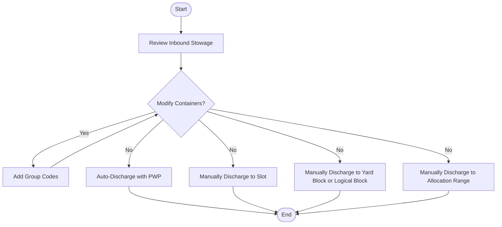

基于您提供的两张流程图内容，我识别出以下核心**用例**（系统功能）和**实体**（数据对象），并结合图像内容进行结构化整理：

---

### **一、核心实体（关键业务对象）**
| 实体名称 | 说明 | 来源图 |
|----------|------|--------|
| **Vessel Visit（船舶访问）** | 船舶进出港的核心业务单元，包含装卸作业计划 | 图1主流程 + 图2终点 |
| **Stowage Plan（积载计划）** | 货物在船舶上的分布规划，分进港（Inbound）和出港（Outbound） | 图1 |
| **Vessel（船舶）** | 船舶基本信息实体 | 图2 |
| **Vessel Class（船舶类别）** | 船舶的分类标准（如集装箱船/散货船） | 图2 |
| **Vessel Service（船务公司）** | 提供船舶运输服务的公司 | 图2 |
| **Line Operator（船公司）** | 船舶运营公司 | 图2 |
| **Work Instruction (WI)（工作指令）** | 指导装卸作业的操作指令 | 图1 |
| **Crane Plan（起重机计划）** | 起重机装卸作业的调度方案 | 图1 |

---

### **二、关键用例（系统功能）**
#### **1. 船舶访问管理流程（图2逻辑）**
| 用例名称 | 说明 | 判断逻辑 |
|----------|------|-----------|
| `创建船舶类别` | 新增船舶类型（当不存在时） | Use Existing Vessel Class? → **No** |
| `创建船务公司` | 新增船务公司（当不存在时） | Use Existing Vessel Service? → **No** |
| `创建船公司` | 新增船舶运营公司（当不存在时） | Use Existing Line Operator? → **No** |
| `创建船舶` | 新增船舶（当不存在时） | Use Existing Vessel? → **No** |
| `创建船舶访问` | 最终创建一次完整的船舶访问记录 | 所有判断为 **Yes** 后执行 |

#### **2. 装卸作业流程（图1主流程）**
| 阶段 | 用例名称 | 说明 |
|------|----------|------|
| **计划阶段** | `添加船舶访问` | 启动作业流程 |
| ^ | `规划泊位（Plan Berth）` | 分配船舶停靠位置 |
| ^ | `管理进港积载计划（Inbound Stowage Plan）` | 处理货物分布规划：  - 自动导入积载计划（Import? → **Yes**）  - 手动录入数据（Import? → **No**） |
| ^ | `配置PWP（Configure PWP）` | 设置港口装卸参数（若使用PWP工具） |
| **卸货阶段** | `创建卸货预计划（Create Preplan）` | 制定卸货方案 |
| ^ | `签发卸货工作指令` | 分发操作任务：  - 用EC系统签发（Issue with EC）  - 纸质签发（On Paper） |
| ^ | `创建起重机计划` | 调度起重机作业 |
| ^ | `完成卸货任务（Complete Moves）` | 记录实际卸货结果 |
| **装货阶段** | `管理空箱订单（Empty Loadout Orders）` | 处理空集装箱任务 |
| ^ | `签发装货工作指令` | 类似卸货指令的分发逻辑 |
| ^ | `完成装货任务（Complete Moves）` | 记录装货结果 |
| **结束阶段** | `导出现港积载计划（Export Outbound Stow Plan）` | 生成离港货物分布文件 |
| ^ | `关闭船舶访问（Close Vessel）` | 结束本次业务 |
| ^ | `打印船舶报告（Print Reports）` | 生成统计报表 |

---

graph TD
    S2([Start]) --> RP{Receive Preplan from Line Op?}
    RP -->|Yes| IMD[Import MOVINS Data]
    RP -->|No| MPG[Manually Create Projection Groups]
    MPG --> PPV[Plan Projections to Vessel]
    IMD --> CL[Compare Load List to Projections]
    PPV --> CL
    CL --> E2([End])

graph TD
    S3([Start]) --> CR[Check and Resolve Load List Discrepancies]
    CR --> CL[Compare Load List with Preplan]
    CL --> RC[Review Container Positions]
    RC --> RP[Review Preplanned Bays]
    RP --> UA{Use AutoStow?}
    UA -->|Yes| PA[Plan Load with AutoStow]
    UA -->|No| UP{Use PWP?}
    UP -->|Yes| PP[Plan Load with PWP]
    UP -->|No| SS[Select, Sequence, and Place Containers]
    PA --> RE[Review Plan for Stowage Errors]
    PP --> RE
    SS --> RE
    RE --> EA[Ensure All Containers Are Planned]
    EA --> EC[Ensure All Projections Are Covered]
    EC --> PC[Prevent Changes to Planned Moves]
    PC --> E3([End])

graph TD
    S4([Start]) --> VV[Verify Visit Details]
    VV --> SV[Set Vessel and Views]
    SV --> AC{Auto-Create Crane Workshifts?}
    AC -->|No| MC1[Manually Create Shifts]
    AC -->|Yes| ST{Shift Templates Available?}
    ST -->|Yes| CT[Create Shift Templates]
    ST -->|No| MC2[Manually Create Shifts]
    CT --> CS[Automatically Create Shifts]
    MC1 --> CS
    MC2 --> CS
    CS --> AW{Auto-Assign Work Queues?}
    AW -->|Yes| AS[Automatically Sequence WQs]
    AW -->|No| MS[Manually Sequence WQs]
    AS --> RC[Refine the Crane Plan]
    MS --> RC
    RC --> RF[Review the Final Crane Plan]
    RF --> E4([End])

graph TD
    S5([Start]) --> UE{Use EDI?}
    UE -->|Yes| VS[Vessel Stow Plan]
    VS --> LI[Load the Inbound EDI Session]
    LI --> RE[Review the EDI Interchange and Post the EDI Batch]
    UE -->|No| AI[Add Inbound Stow Plan]
    RE --> MI[Maintain Inbound Stow Plan]
    AI --> MI
    MI --> E5([End])