# TOS港口操作系统 - 船舶调度上下文关系图

## 1. 整体架构图

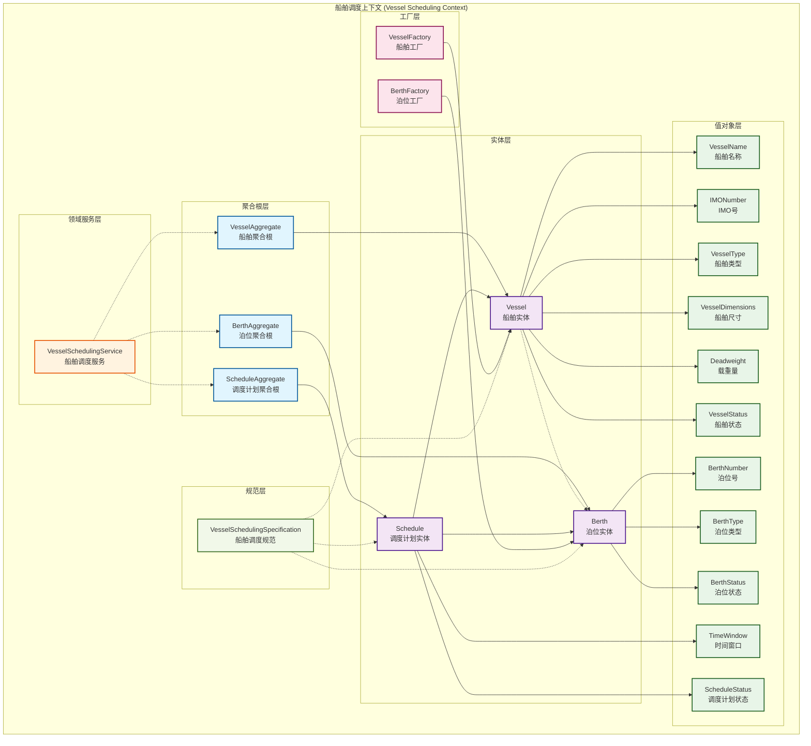

## 2. 船舶聚合根详细关系图

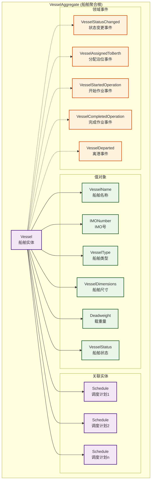

## 3. 泊位聚合根详细关系图

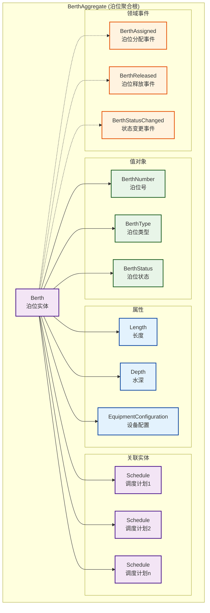

## 4. 调度计划聚合根详细关系图

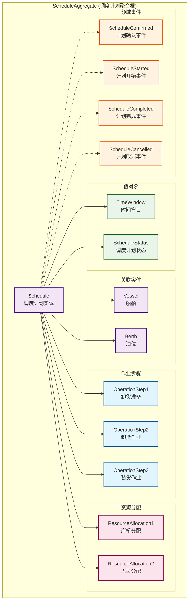

## 5. 状态转换图

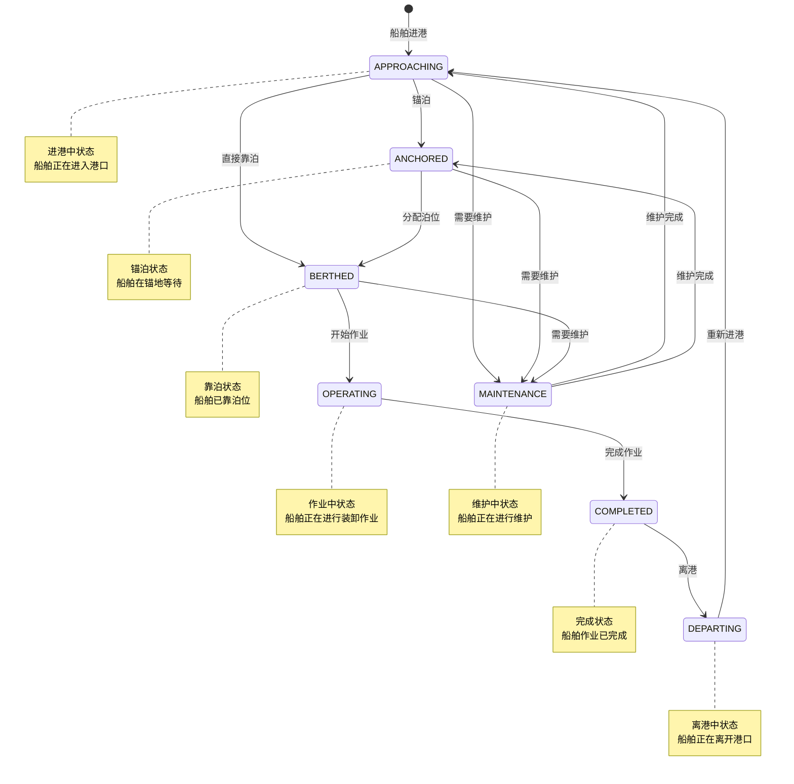

## 6. 泊位状态转换图

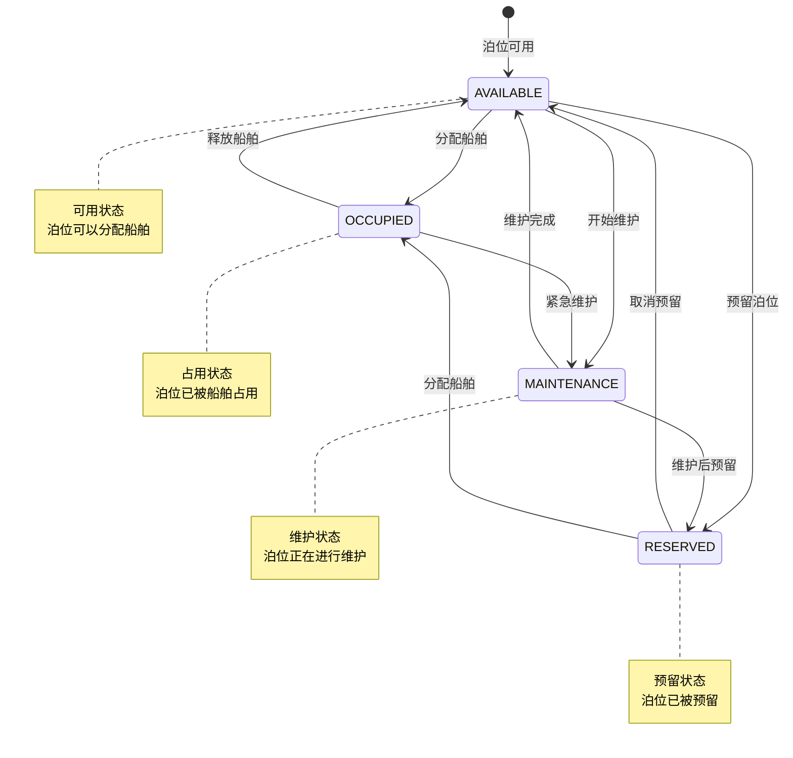

## 7. 调度计划状态转换图

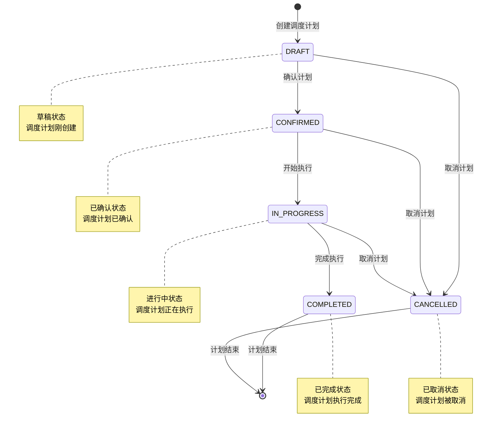

## 8. 领域服务关系图

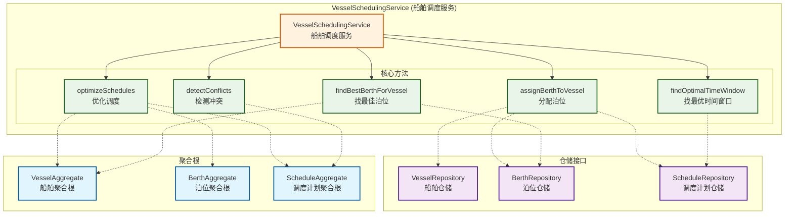

## 9. 工厂模式关系图

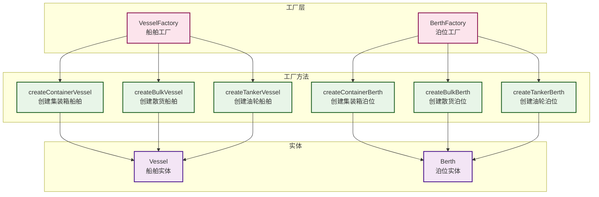

## 10. 规范验证关系图

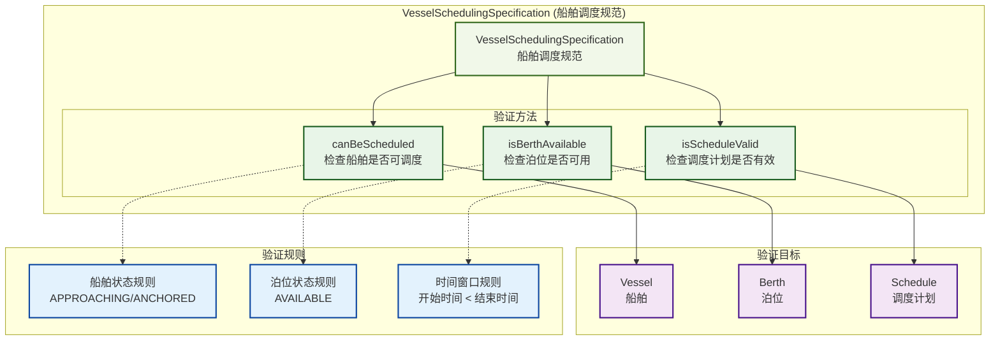

## 11. 数据流图

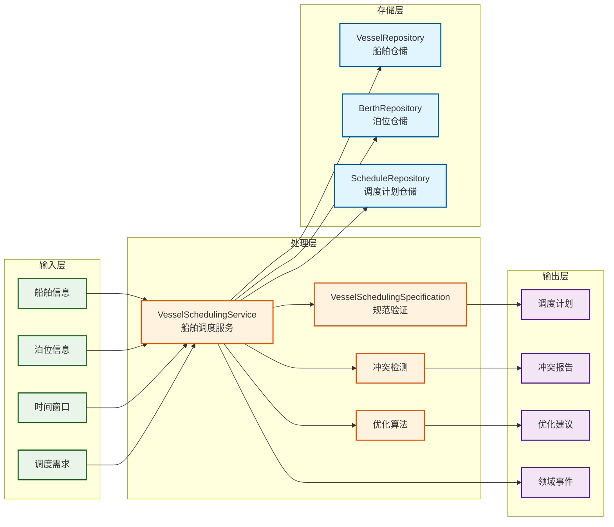

---

**图表说明：**

1. **整体架构图**：展示了船舶调度上下文的整体架构和各层之间的关系
2. **聚合根详细关系图**：展示了每个聚合根内部的详细结构
3. **状态转换图**：展示了船舶、泊位、调度计划的状态转换规则
4. **领域服务关系图**：展示了领域服务与其他组件的关系
5. **工厂模式关系图**：展示了工厂模式的使用
6. **规范验证关系图**：展示了规范验证的机制
7. **数据流图**：展示了数据的流动和处理过程

这些图表清晰地展示了船舶调度上下文中各个组件之间的关系，有助于理解整个系统的架构和设计。 