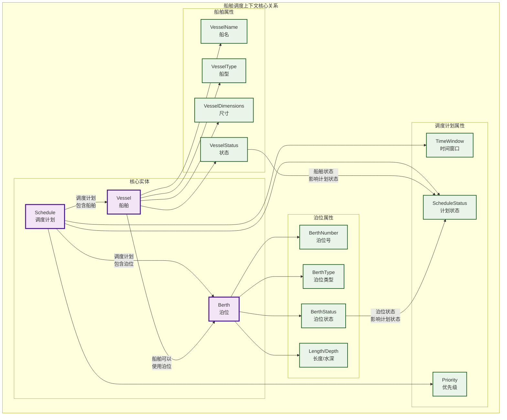
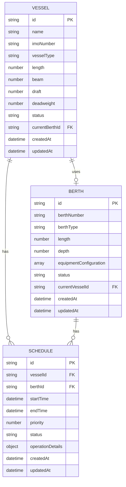
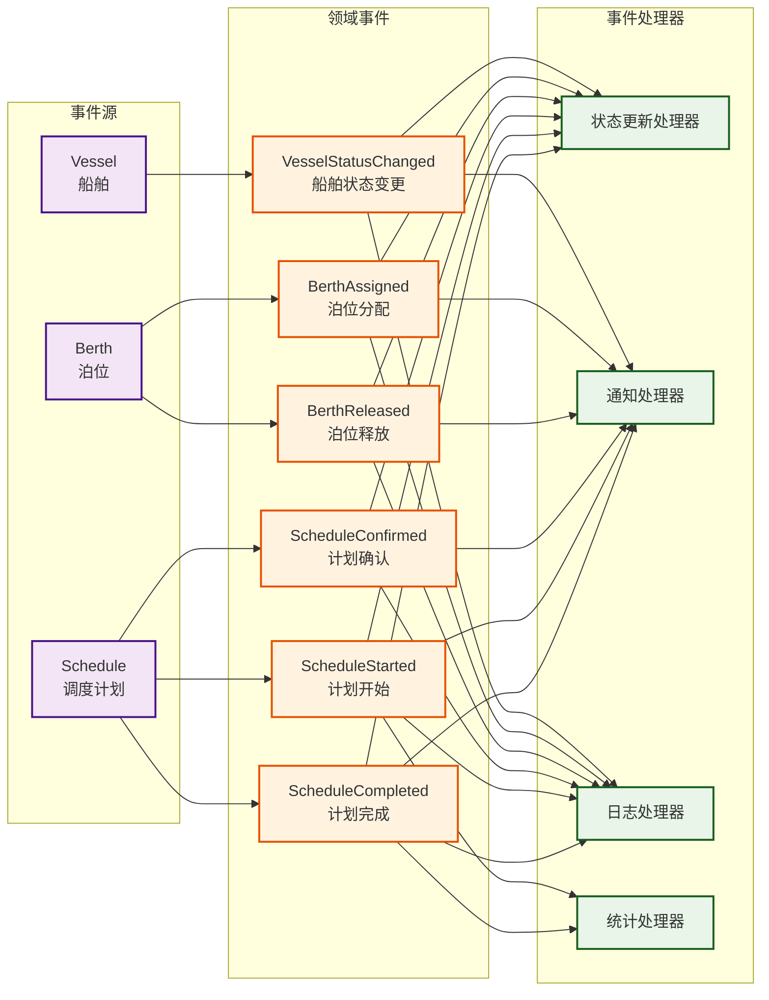
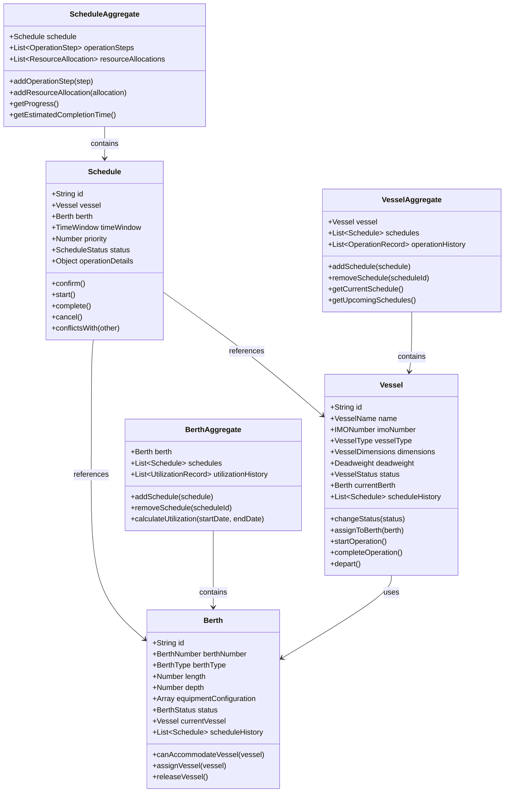

# TOS港口操作系统 - 船舶调度上下文核心关系图

## 1. 核心实体关系图



## 2. 业务流程图

```mermaid
flowchart TD
    A[船舶进港] --> B{船舶状态检查}
    B -->|进港中| C[锚泊或直接靠泊]
    B -->|其他状态| D[状态错误]
    
    C --> E[选择泊位]
    E --> F{泊位兼容性检查}
    F -->|兼容| G[创建调度计划]
    F -->|不兼容| H[选择其他泊位]
    
    G --> I[时间窗口检查]
    I --> J{时间冲突检查}
    J -->|无冲突| K[确认调度计划]
    J -->|有冲突| L[调整时间窗口]
    
    K --> M[开始作业]
    M --> N[作业进行中]
    N --> O[作业完成]
    O --> P[船舶离港]
    
    H --> E
    L --> I
    
    classDef start fill:#e8f5e8,stroke:#1b5e20,stroke-width:2px
    classDef process fill:#e3f2fd,stroke:#0d47a1,stroke-width:2px
    classDef decision fill:#fff3e0,stroke:#e65100,stroke-width:2px
    classDef end fill:#fce4ec,stroke:#880e4f,stroke-width:2px
    classDef error fill:#ffebee,stroke:#c62828,stroke-width:2px
    
    class A start
    class C,E,G,K,M,N,O process
    class B,F,I,J decision
    class P end
    class D error
```

## 3. 数据关系图



## 4. 状态转换关系图

```mermaid
graph LR
    subgraph "船舶状态"
        V1[APPROACHING<br/>进港中]
        V2[ANCHORED<br/>锚泊]
        V3[BERTHED<br/>靠泊]
        V4[OPERATING<br/>作业中]
        V5[COMPLETED<br/>完成]
        V6[DEPARTING<br/>离港中]
    end
    
    subgraph "泊位状态"
        B1[AVAILABLE<br/>可用]
        B2[OCCUPIED<br/>占用]
        B3[MAINTENANCE<br/>维护]
        B4[RESERVED<br/>预留]
    end
    
    subgraph "调度计划状态"
        S1[DRAFT<br/>草稿]
        S2[CONFIRMED<br/>已确认]
        S3[IN_PROGRESS<br/>进行中]
        S4[COMPLETED<br/>已完成]
        S5[CANCELLED<br/>已取消]
    end
    
    %% 船舶状态转换
    V1 --> V2
    V1 --> V3
    V2 --> V3
    V3 --> V4
    V4 --> V5
    V5 --> V6
    
    %% 泊位状态转换
    B1 --> B2
    B1 --> B3
    B1 --> B4
    B2 --> B1
    B2 --> B3
    B3 --> B1
    B4 --> B1
    B4 --> B2
    
    %% 调度计划状态转换
    S1 --> S2
    S1 --> S5
    S2 --> S3
    S2 --> S5
    S3 --> S4
    S3 --> S5
    
    %% 状态关联
    V3 -.-> B2 : 船舶靠泊<br/>泊位占用
    V4 -.-> S3 : 船舶作业<br/>计划进行
    V5 -.-> S4 : 船舶完成<br/>计划完成
    
    classDef vesselState fill:#e8f5e8,stroke:#1b5e20,stroke-width:2px
    classDef berthState fill:#e3f2fd,stroke:#0d47a1,stroke-width:2px
    classDef scheduleState fill:#fff3e0,stroke:#e65100,stroke-width:2px
    
    class V1,V2,V3,V4,V5,V6 vesselState
    class B1,B2,B3,B4 berthState
    class S1,S2,S3,S4,S5 scheduleState
```

## 5. 聚合根边界图

```mermaid
graph TB
    subgraph "VesselAggregate (船舶聚合根)"
        V[Vessel<br/>船舶实体]
        VH[ScheduleHistory<br/>调度历史]
        VO[OperationHistory<br/>操作历史]
        VE[DomainEvents<br/>领域事件]
    end
    
    subgraph "BerthAggregate (泊位聚合根)"
        B[Berth<br/>泊位实体]
        BH[ScheduleHistory<br/>调度历史]
        BU[UtilizationHistory<br/>利用率历史]
        BE[DomainEvents<br/>领域事件]
    end
    
    subgraph "ScheduleAggregate (调度计划聚合根)"
        S[Schedule<br/>调度计划实体]
        SO[OperationSteps<br/>作业步骤]
        SR[ResourceAllocations<br/>资源分配]
        SE[DomainEvents<br/>领域事件]
    end
    
    %% 聚合根内部关系
    V --> VH
    V --> VO
    V --> VE
    
    B --> BH
    B --> BU
    B --> BE
    
    S --> SO
    S --> SR
    S --> SE
    
    %% 聚合根间关系（通过ID引用）
    V -.-> S : 引用调度计划ID
    B -.-> S : 引用调度计划ID
    S --> V : 包含船舶引用
    S --> B : 包含泊位引用
    
    classDef aggregate fill:#e1f5fe,stroke:#01579b,stroke-width:3px
    classDef entity fill:#f3e5f5,stroke:#4a148c,stroke-width:2px
    classDef collection fill:#e8f5e8,stroke:#1b5e20,stroke-width:2px
    
    class V,B,S entity
    class VH,VO,VE,BH,BU,BE,SO,SR,SE collection
```

## 6. 领域事件流图



## 7. 简化的类图



---

**图表说明：**

1. **核心实体关系图**：展示了船舶、泊位、调度计划三个核心实体及其属性之间的关系
2. **业务流程图**：展示了从船舶进港到离港的完整业务流程
3. **数据关系图**：展示了实体间的数据关系和外键约束
4. **状态转换关系图**：展示了三个实体的状态转换及其关联关系
5. **聚合根边界图**：展示了DDD聚合根的边界和内部结构
6. **领域事件流图**：展示了领域事件的产生和处理流程
7. **简化的类图**：展示了核心类的属性和方法

这些图表从不同角度展示了船舶调度上下文的核心关系，有助于理解系统的整体架构和业务逻辑。 